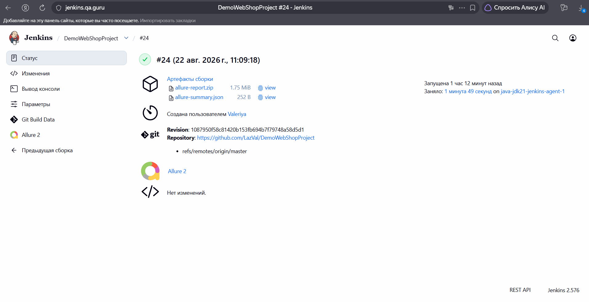
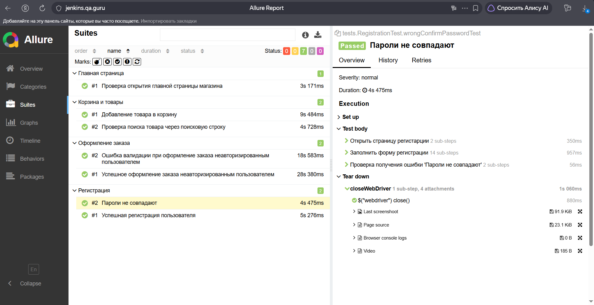
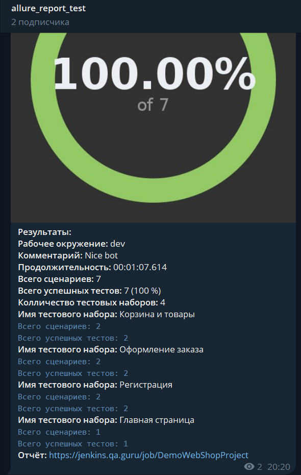

# Test Automation Project for [DemoWebShop](https://demowebshop.tricentis.com/)

## **Contents:** ##

* <a href="#tools">Technologies and tools</a>
* <a href="#cases">Examples of automated test cases</a>
* <a href="#jenkins">Build in Jenkins</a>
* <a href="#console">Run from Terminal</a>
* <a href="#allure">Allure report</a>
* <a href="#telegram">Telegram notification with bot</a>
* <a href="#video">Selenoid test execution video examples</a>


-----
<a id="tools"></a>
## <a name="Technologies and tools">**Technologies and tools:**</a>

<p align="center">
<a href="https://www.w3schools.com/java/">  </a> 
<a href="https://www.jetbrains.com/idea/">  </a> 
<a href="https://git-scm.com/">  </a> 
<a href="https://junit.org/junit5">  </a>
<a href="https://selenide.org">  </a>
<a href="https://gradle.org">  </a>
<a href="https://allurereport.org/">  </a>
<a href="https://www.jenkins.io">  </a>
</p>

- The UI autotests were written in **Java**.
- **Gradle** was used as a builder.
- **JUnit 5** and **Selenide** frameworks were used as test frameworks.
- For remote run, a job in **Jenkins** with **Allure report** generation and result send to **Telegram** via a bot has been implemented.


----
<a id="cases"></a>
## **Examples of automated test cases:**

- ✅ Opening the main page of the site
- ✅ User registration
- ✅ Getting an error "Passwords do not match"
- ✅ Successful order placement by an unauthenticated user
- ✅ Validation error when placing an order by an unauthenticated user
- ✅ Product search via the search bar
- ✅ Adding a product to the cart


----
<a id="jenkins"></a>
## Build in Jenkins ([link](https://jenkins.qa.guru/job/DemoWebShopProject/))

<p align="center">  
<a href="https://jenkins.qa.guru/job/DemoWebShopProject/"></a>  
</p>

### **Jenkins build options:**

- `BROWSER` (default CHROME)
- `SELENOID_URL`
- `HEADLESS` (default false)
- `BROWSER_VERSION` (Selenoid chrome 148.0 / 149.0)
- `SIZE`


----
<a id="console"></a>
## Run from Terminal
___
**Local launch**
```bash  
gradle clean test
```

**Remote launch via Jenkins**
```bash
clean test
-Dbrowser=${BROWSER}
-DselenoidUrl=${SELENOID_URL}
-DremoteUrl=${REMOTE}
-Dheadless=${HEADLESS}
-DbrowserVersion=${BROWSER_VERSION}
-Dsize=${SIZE}
```

----
<a id="allure"></a>
## Allure report ([link](https://jenkins.qa.guru/job/DemoWebShopProject/allure/))

**Allure report overview**
<p align="center">  
<a href="https://jenkins.qa.guru/job/DemoWebShopProject/allure/"></a>  
</p>

**Suites – test cases**
<p align="center">  
<a href="https://jenkins.qa.guru/job/DemoWebShopProject/allure/"></a>  
</p>

----
<a id="telegram"></a>
## Telegram notification with bot
<p align="center">  
 
</p>

----
<a id="video"></a>
## Selenoid test execution video examples
<p align="center">
   
</p>
